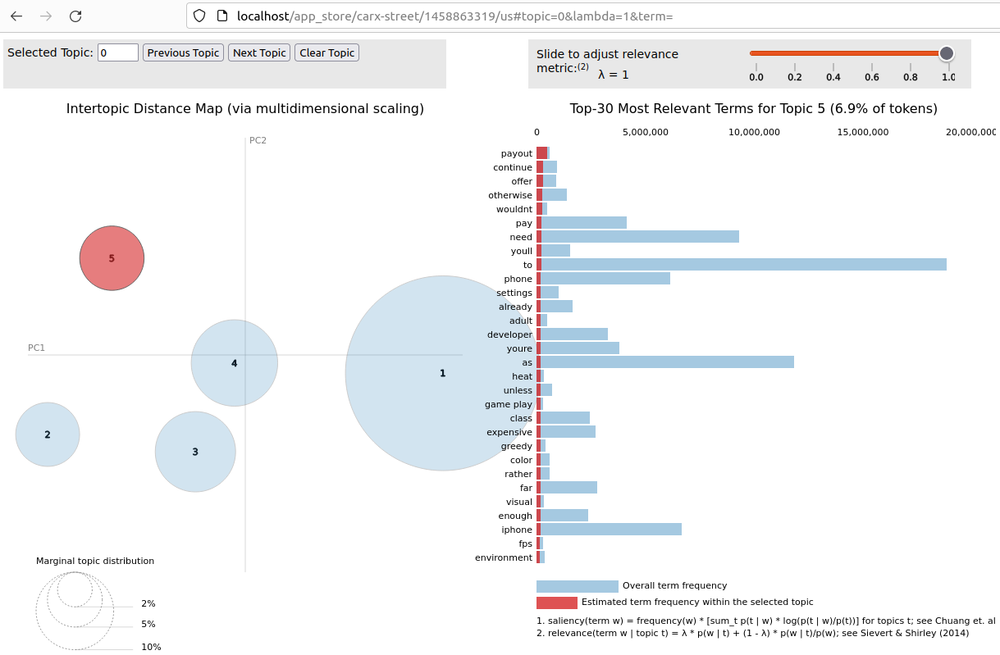

# App Review

## Цель учебного проекта

Получить практические навыки решения базовых задач, на основе знаний полученных по дисциплине "Обработка и анализ больших массивов данных". В качестве темы проекта выбрана "Тематическое моделирование на основе отзывов из магазинов приложений App Store и Google Play".

Предлагаемое решение организует процесс сбора отзывов из магазинов приложений, сохранение полученных данных в Hadoop HDFS, их последующую обработку в Apache Spark для формирования топиков - набора слов, которые описывают содержание отзывов. Построенная, на основе отзывов, LDA модель используется для визуального представления близости тем и слов между собой. Веб-сервис предоставляет единую точку для доступа к обработанным данным и к визуализациям, полученные на основе этих данных.

Смоделированные топики, дают дополнительную аналитическую информацию о выпущенном приложении, на основе анализа ключевых слов в отзывах, оставленных пользователями на веб-странице приложения. На основе LDA модели топиков, временного интервала отзывов и версии приложения, можно формулировать предположения о значимых для пользователя факторах, влияющих на успех или спад интереса к приложению у аудитории.

## Основные компоненты системы

### ETL

В ETL реализуются шаги по сбору и обработке отзывов и сохранению результирующих данных в базу данных:

* ***Extract*** - извлечение отзывов приложений из App Store и Google Play, на основе web API этих магазинов. Валидация полученных данных и их сохранение в хранилище HDFS. Для представления данных, в кластере Spark, используется Spark DataFrame, а для хранения в Hadoop HDFS применяется формат данных Apache Parquet.


* ***Transform*** - предобработка отзывов средствами Spark DataFrame и с использованием библиотеки Spark NLP. Решение Spark NLP построено на основе Apache Spark и Spark ML, предоставляет API для организации конвейера распределённой обработки естественного языка на кластере. Предобработанные данные используются для построения LDA модели, на основе которой происходит формирование топиков (набора тем и списка терминов, образующих эти темы).


* ***Load*** - сохранение LDA модели и мета данных в PostgreSQL базу данных.

Использование кластера Spark для распределенной обработки текста, Hadoop-кластера и распределенной файловой системы HDFS для обрабатываемых данных и PostgresSQL для web-приложения, позволяет гибко масштабировать количество приложений и отзывов из различных источников, а также сложность алгоритмов предобработки данных и построения аналитических моделей. В общем случае, для представленного решения, достаточно было одной вычислительной машины и реляционной базы данных для хранения собранных и результирующих данных. Технические усложнения с применением Apache Spark и Apache Hadoop были продиктованы желанием разобраться в практическом приминении популярных решениях для больших данных.

Замечание: для доступа к Google Play из России может понадобиться VPN.

### Apache Airflow

Airflow применяется для описания DAG'a ETL процесса и его ежедневного запуска по расписанию. DAG может быть дополнен для сбора отзывов различных приложений из App Store и Google Play.

### Webapp

Веб-приложение на основе фреймворка FastAPI, предоставляет пользователю UI для доступа к собранным данным и их визуализации на основе библиотеки pyLDAvis. Для работы с СУБД PostgreSQL используется пакет Psycopg2.

Визуализация топиков с использование библиотеки pyLDAvis:



### Docker

Для удобства разработки и получения навыков DevOps была использована контейнеризация Spark и Hadoop кластера, а также PostgreSQL, Airflow и FastAPI сервисов, с использованием Docker.

```commandline
docker compose up --build                   # сборка docker образов и запуск контейнеров
docker compose down --volumes               # остановка и удаление контейнеров с разделами для данных и сетей
```

* http://localhost:80/ - веб-сайт, UI представления данных
* http://localhost:8080 - Airflow для запуска и мониторинга DAG'а
* http://localhost:9870 - UI наймноды HDFS
* http://localhost:8081/ - UI Spark мастера

## Общие настройки

* **docker-compose.yml** - настройки docker сервисов, переменные окружения, порты, названия и т.п.
* **configs/hadoop.env** - настройки переменных окружения для Hadoop сервисов в файле docker-compose.yml.
* **configs/config.yaml** - единый файл настроек для инициализации SparkSession, создания соединения к PostgreSQL базе данных и гиперпараметры обучения LDA модели.

Замечание: Все секреты в файлах настроек хранятся в открытом виде для упрощения разработки учебного проекта.

Важно: В файле настроек config.yaml имена хостов указаны согласно именованию сервисов в docker-compose.yml. Для корректной локальной разработки, т.е. без запуска DAG'а в контейнере Airflow, необходимо переименовать нужные настройки в local и localhost соответсвенно или добавить в файл hosts следующие значения:
* 127.0.0.1   namenode
* 127.0.0.1   spark-master
* 127.0.0.1   postgres
* 127.0.0.1   airflow

Первоначальная подготовка проекта для воспроизведения результатов и разработки:

```commandline
conda env create -f environment.yml	# создаём окружение и устанавливаем нужные версии python, poetry и airflow (airflow не поддерживает установку через poetry)
conda activate app_review		# активируем окружение для разработки
poetry install				# устанавливаем зависимости необходимые для проекта
pre-commit install			# настраиваем pre-commit git хук
```

Удаление conda окружения и docker артефактов:

```commandline
conda remove -n app_review --all            # полное удаление conda окружения
docker compose down --volumes --rmi all     # остановка сервисов, удаление docker образов, контейнеров, сетей и разделов
```
